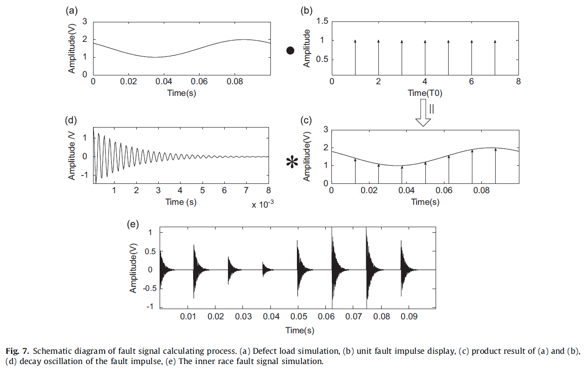

# Fault-Bearing-Signal-Simulation
## I - Description
The program simulate fault bearing signal for CNN-designated classification task. <br>
The implementation is based on:

- [Calculation of Radial Load Distribution on Ball and Roller Bearings with Positive, Negative and Zero Clearance](https://www.sciencedirect.com/science/article/abs/pii/S0020740317304174)
- [Vibration Model of Rolling Element Bearings in a Rotor-bearing](https://www.sciencedirect.com/science/article/pii/S0022460X12009236)

For more details on the classification of fault bearing signal using CNN, please refer to:

## II - Experiment
The project is currently in progress, the expected outcome signal should obtain the shape similar to the figure below:



## III - Installation
The project uses [Poetry](https://python-poetry.org/) as packages and environment manager. In order to install Poetry, follow the [installation guide](https://python-poetry.org/docs/#osx--linux--bashonwindows-install-instructions). \
Run the flowing commands inside the project directory:
```
poetry install
```
to install project dependencies.
```
poetry shell
```
to activate the environment.
